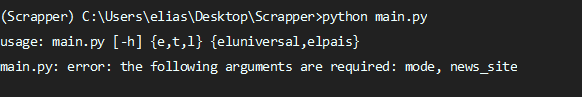
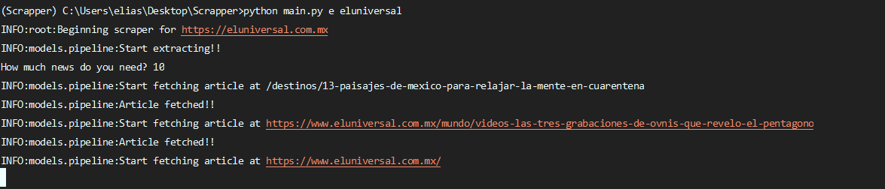
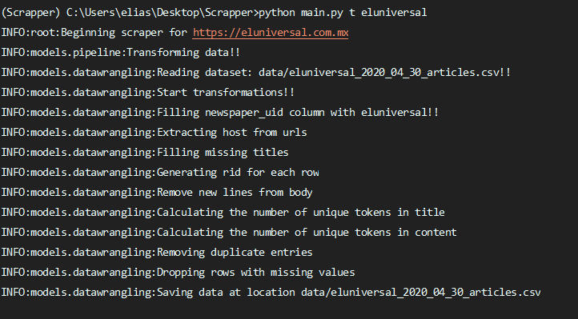
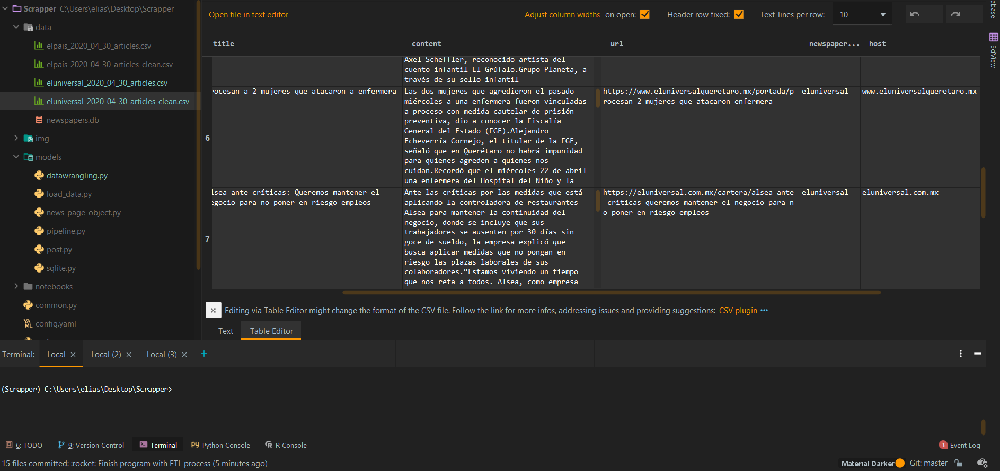

# News DataScrapper <!-- omit in toc -->

> * Data Engineering ETL Process

# Features
* Page Object Pattern for build this solution
* Configurable for read every newsfeed
* Find by topic
* Select newspapper

> This project has build with PyCharm / Anaconda and Python 3.7.7

# Project Structure
* data
    * RawDataset and Clean Dataset
* models
    * Dataflow for procesing data
* notebooks
    * Explore and test problem

# Preview

<div align="center">
  
</div>

<div align="center">
  
</div>

<div align="center">
  
</div>

<div align="center">
  
</div>


# How to run

You can use conda or python to execute this project

```shell
conda create --name data
conda activate data
pip install requirements.txt
python main.py
```

# How to contribute

Sendme a pullrequest  or contactme on social networks as eocode